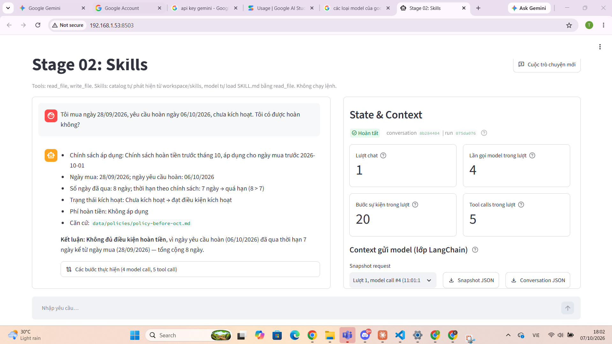
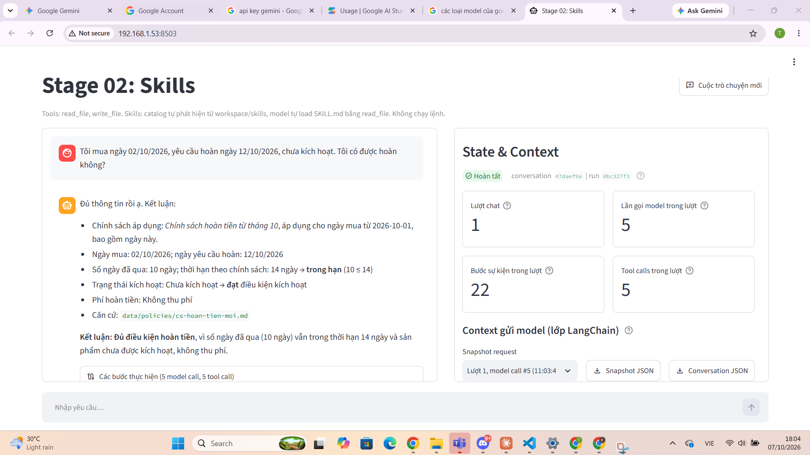
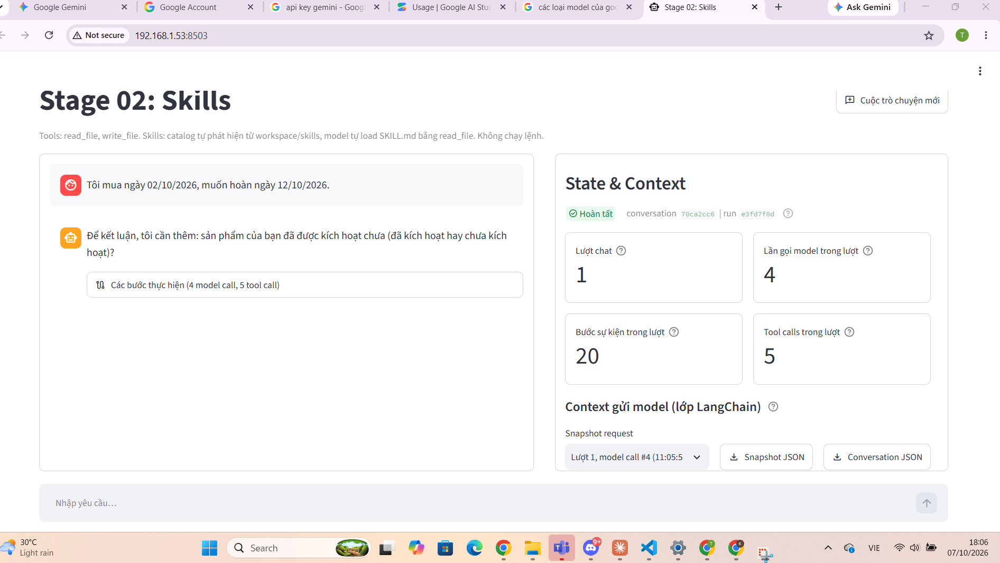
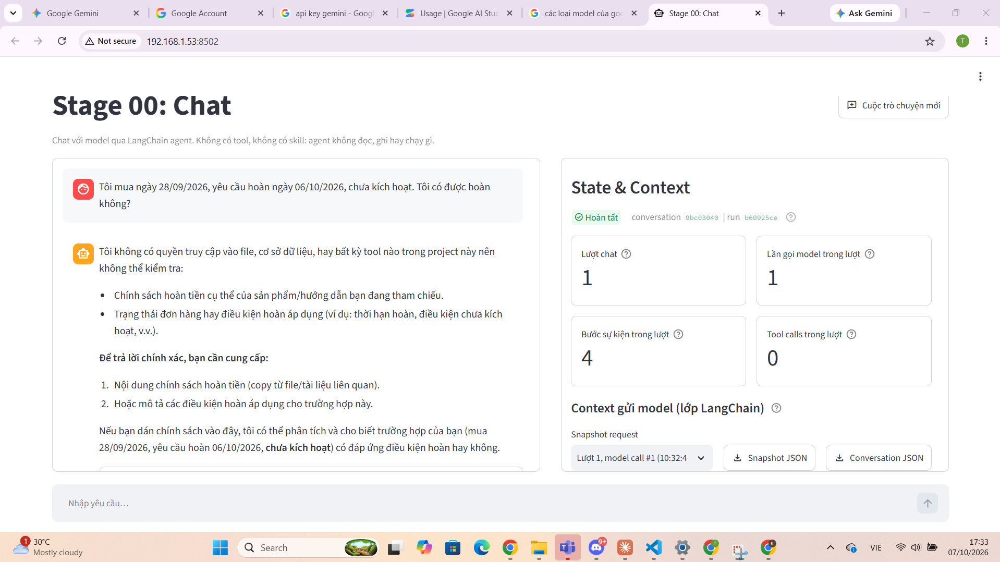
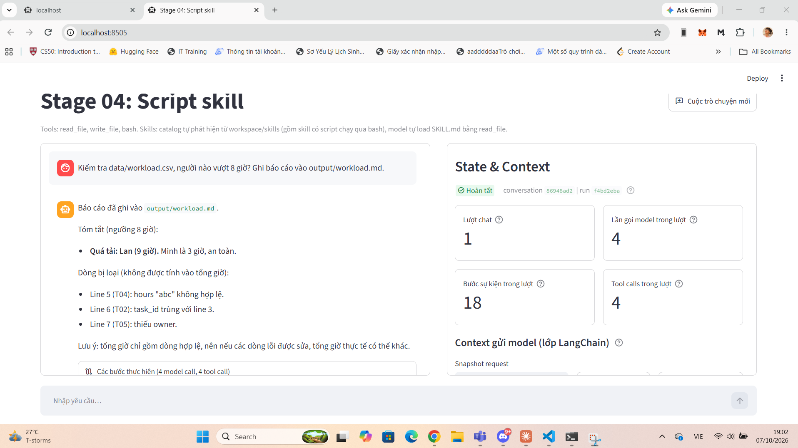
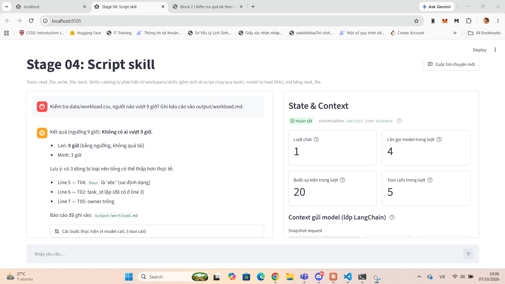
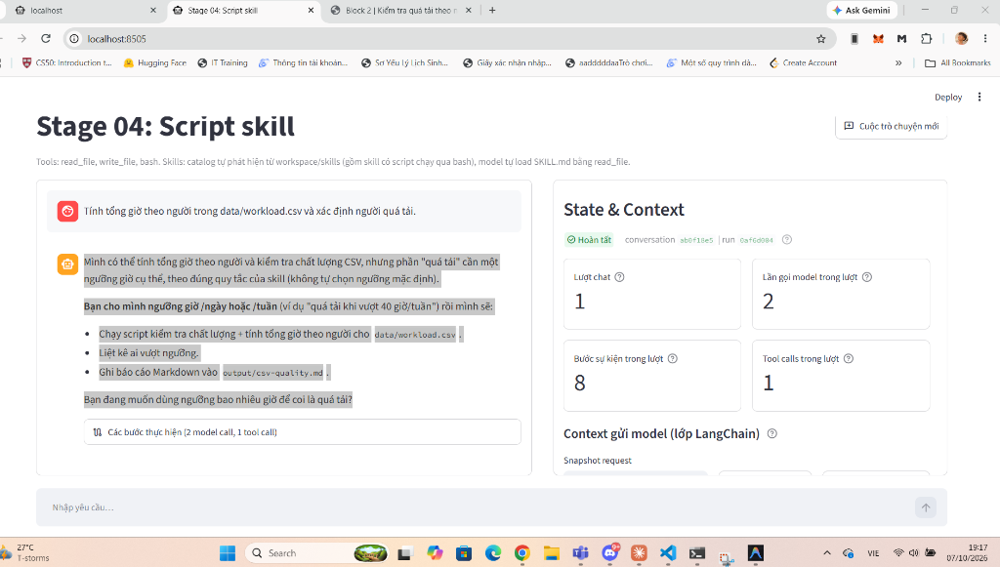
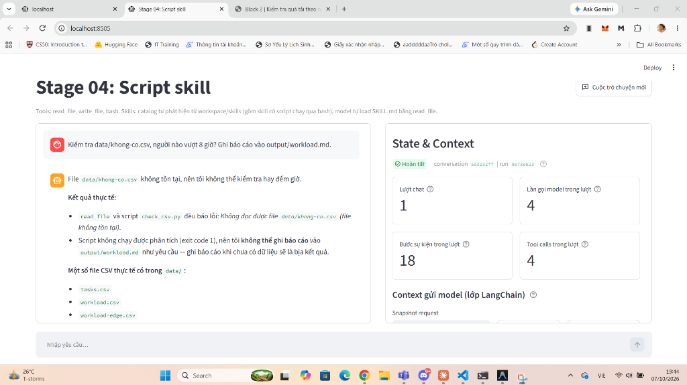
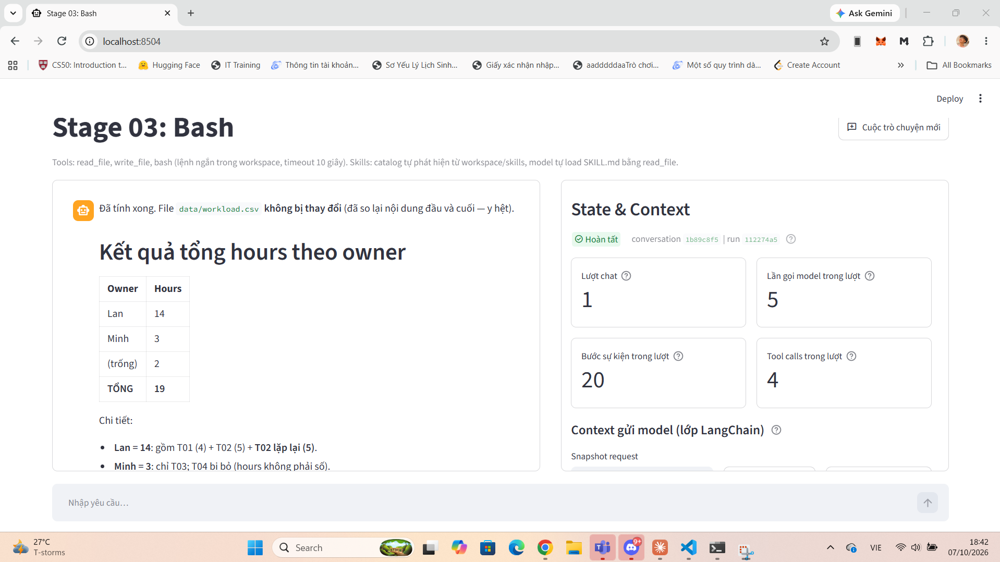
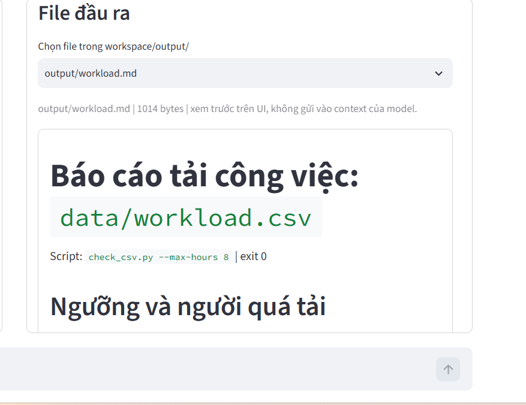

# Agent Tools & Skills Lab: bài làm Block 1 và Block 2

| | |
|---|---|
| **Sinh viên** | Đỗ Tấn Tường |
| **MSSV** | 23521749 |
| **Block 1: phân tích** | [`block1/analysis.md`](block1/analysis.md) |
| **Block 1: tool `list_files`** | [`stage-02-skills-block1/tools/files.py`](stage-02-skills-block1/tools/files.py) (bản giống hệt trong [`stage-01-files-block1`](stage-01-files-block1/tools/files.py)) |
| **Block 1: skill `refund-policy`** | [`stage-02-skills-block1/workspace/skills/refund-policy/`](stage-02-skills-block1/workspace/skills/refund-policy/) |
| **Block 2: phân tích** | [`block2/analysis.md`](block2/analysis.md) |
| **Block 2: skill `csv-quality`** | [`stage-04-script-skill-block2/workspace/skills/csv-quality/`](stage-04-script-skill-block2/workspace/skills/csv-quality/) (script `scripts/check_csv.py`) |
| **Danh sách đầy đủ** | [Danh sách file nộp theo đề](#danh-sách-file-nộp-theo-đề) (trace, JSON, ảnh) |

Bài lab gồm các LangChain agent có giao diện chat Streamlit, mỗi stage thêm một năng lực: chat, rồi đọc/ghi file, rồi skill, rồi bash, rồi skill có script. Repo này chứa project mẫu (5 stage gốc, giữ nguyên) và **bài làm** của hai bài tập:

- **Block 1: Tra cứu chính sách đúng phiên bản.** Thêm tool `list_files` và skill `refund-policy`.
- **Block 2: Kiểm tra quá tải theo người.** Mở rộng script `check_csv.py` với `--max-hours`, cập nhật skill `csv-quality`.

> [!IMPORTANT]
> Bài làm nằm trong các **bản sao** có hậu tố `-block1` và `-block2`. Các thư mục `stage-0x-*` gốc được giữ nguyên theo yêu cầu đề. Kết quả, phân tích và bằng chứng nằm trong `block1/` và `block2/`.

## Danh sách file nộp theo đề

### Block 1: Tra cứu chính sách đúng phiên bản

| Yêu cầu nộp của đề | File |
|---|---|
| Mã nguồn tool mới và phần đăng ký tool ở stage 01, stage 02 | `stage-01-files-block1/tools/files.py`, `tools/__init__.py`, `agent.py`; tương tự trong `stage-02-skills-block1/` |
| Thư mục skill `refund-policy/` | `stage-02-skills-block1/workspace/skills/refund-policy/SKILL.md`, `references/answer-template.md` (bản đồng bộ trong `fixtures/skills/refund-policy/`) |
| Hai tài liệu chính sách | `workspace/data/policies/policy-before-oct.md`, `policy-from-oct.md` (trong cả hai bản sao, kèm bản trong `fixtures/`) |
| Trace trường hợp A | `stage-02-skills-block1/traces/20261007-180105_8b284404_turn01_075da076.jsonl` |
| Trace trường hợp B sau khi đổi tên file | `stage-02-skills-block1/traces/20261007-180332_47daef9a_turn01_0bc327f3.jsonl` |
| Trace trường hợp thiếu thông tin | `stage-02-skills-block1/traces/20261007-180549_70ca2cc6_turn01_e3fd7f8d.jsonl` |
| Trace Stage 00 (xác định giới hạn) | `stage-00-chat/traces/20261007-173247_9bc03040_turn01_b60925ce.jsonl` |
| `analysis.md`: kết quả kiểm tra tool, từng trường hợp, vị trí bằng chứng, câu hỏi cuối bài | `block1/analysis.md` |
| Bằng chứng bổ sung | `block1/screenshots/*.png` |
| Test (bổ sung) | `stage-01-files-block1/tests/test_files.py`, `test_agent.py`; `stage-02-skills-block1/tests/test_skill_catalog.py`, `test_agent.py` |

### Block 2: Kiểm tra quá tải theo người

| Yêu cầu nộp của đề | File |
|---|---|
| Skill `csv-quality` đã cập nhật: script, hướng dẫn, reference | `stage-04-script-skill-block2/workspace/skills/csv-quality/scripts/check_csv.py`, `SKILL.md`, `references/report-template.md` |
| Bản đồng bộ trong fixtures | `stage-04-script-skill-block2/fixtures/skills/csv-quality/` (giống hệt `workspace/`) |
| CSV đầu vào | `workspace/data/workload.csv` (stage 03 và stage 04), `workspace/data/workload-edge.csv` (stage 04), kèm bản trong `fixtures/data/` |
| Kiểm thử tự động cho trường hợp ID đầu tiên có hours không hợp lệ | `stage-04-script-skill-block2/tests/test_check_csv.py::test_first_occurrence_with_invalid_hours_still_wins_duplicate` |
| JSON chạy script trực tiếp với ngưỡng 8 và 9 | `block2/results/workload-max-8.json`, `block2/results/workload-max-9.json` |
| Kết quả trường hợp đặc biệt | `block2/results/workload-edge-max-0.json` |
| Log lỗi (file thiếu, thiếu ngưỡng) | `block2/results/errors.txt` |
| Báo cáo agent tạo | `block2/results/agent-report-max8.md`, `block2/results/agent-report-max9.md` |
| Trace ngưỡng 8 | `stage-04-script-skill-block2/traces/20261007-190101_86948ad2_turn01_f4bd2eba.jsonl` |
| Trace ngưỡng 9 | `stage-04-script-skill-block2/traces/20261007-190437_10675312_turn01_b1054d3f.jsonl` |
| Trace thiếu ngưỡng | `stage-04-script-skill-block2/traces/20261007-190834_ab0f18e5_turn01_0af6d004.jsonl` |
| Trace file không tồn tại | `stage-04-script-skill-block2/traces/20261007-194333_5d3232ff_turn01_8e78e623.jsonl` |
| Trace Stage 03 (Python qua Bash) | `stage-03-bash-block2/traces/20261007-184125_1b89c8f5_turn01_112274a5.jsonl` |
| `analysis.md`: thay đổi, kết quả từng trường hợp, vị trí bằng chứng, câu hỏi cuối bài | `block2/analysis.md` |
| Bằng chứng bổ sung | `block2/screenshots/*.png` |

> [!CAUTION]
> **Không nộp** các file `.env` (chứa API key) và các thư mục `.venv/`, `__pycache__/`, `.pytest_cache/`.

## Kết quả đạt được

Tất cả trường hợp đề yêu cầu đều đạt khi chạy live với model `qwen/qwen3.8-27b` (Groq). Chi tiết từng lần chạy, trace và đối chiếu nằm trong [`block1/analysis.md`](block1/analysis.md) và [`block2/analysis.md`](block2/analysis.md).

### Block 1: Tra cứu chính sách đúng phiên bản

| Trường hợp | Kết quả cần đạt | Kết quả thực tế |
|---|---|---|
| Stage 00 (giới hạn) | Agent không đọc được tài liệu | ✅ 0 tool call, agent yêu cầu người dùng tự dán chính sách |
| A: mua 28/09, hoàn 06/10, chưa kích hoạt | Chính sách cũ, 8 ngày, không đủ điều kiện | ✅ `list_files` rồi đọc `policy-before-oct.md`, 8 > 7 ngày, **không đủ điều kiện** |
| B sau khi đổi tên file: mua 02/10, hoàn 12/10, chưa kích hoạt | Tìm được file tên mới, chính sách mới, đủ điều kiện | ✅ `list_files` thấy `cs-hoan-tien-moi.md`, 10 ≤ 14 ngày, **đủ điều kiện**, không thu phí |
| Thiếu trạng thái kích hoạt | Hỏi lại, chưa kết luận | ✅ Agent hỏi sản phẩm đã kích hoạt chưa, không tự giả định |

<table>
  <tr>
    <td width="50%"><br><sub>Trường hợp A: chính sách cũ, không đủ điều kiện</sub></td>
    <td width="50%"><br><sub>Trường hợp B sau khi đổi tên file: chính sách mới, đủ điều kiện</sub></td>
  </tr>
  <tr>
    <td width="50%"><br><sub>Thiếu thông tin: agent hỏi trạng thái kích hoạt</sub></td>
    <td width="50%"><br><sub>Stage 00: không có tool, không đọc được tài liệu</sub></td>
  </tr>
</table>

### Block 2: Kiểm tra quá tải theo người

| Trường hợp | Kết quả cần đạt | Kết quả thực tế |
|---|---|---|
| Stage 03 (Python qua Bash) | Cho thấy rủi ro khi model tự viết code | ⚠️ Model cộng trùng T02 nên Lan = **14** giờ (sai), gom owner rỗng thành một nhóm |
| Stage 04, ngưỡng 8 | Lan 9, Minh 3, chỉ Lan quá tải, loại dòng 5, 6, 7 | ✅ Chạy `--max-hours 8`, **Lan quá tải**, báo cáo ghi một lần |
| Stage 04, ngưỡng 9 | Không ai quá tải | ✅ Lan 9 giờ bằng ngưỡng nên **không quá tải** |
| Thiếu ngưỡng | Hỏi ngưỡng trước khi kết luận | ✅ Agent hỏi lại, không chạy script |
| File không tồn tại | Script exit khác 0, agent báo không phân tích được | ✅ Script exit 1, agent không ghi báo cáo, không bịa số liệu |

Script `check_csv.py` có 74 test passed, kể cả test ID đầu tiên có hours không hợp lệ vẫn giữ quyền ưu tiên khi trùng.

<table>
  <tr>
    <td width="50%"><br><sub>Ngưỡng 8: Lan 9 giờ vượt ngưỡng</sub></td>
    <td width="50%"><br><sub>Ngưỡng 9: không ai quá tải</sub></td>
  </tr>
  <tr>
    <td width="50%"><br><sub>Thiếu ngưỡng: agent hỏi lại</sub></td>
    <td width="50%"><br><sub>File không tồn tại: script exit 1</sub></td>
  </tr>
  <tr>
    <td width="50%"><br><sub>Stage 03: model tự viết code, Lan = 14 (sai)</sub></td>
    <td width="50%"><br><sub>Báo cáo <code>output/workload.md</code> do agent ghi (ngưỡng 8)</sub></td>
  </tr>
</table>

## Mục lục

- [Danh sách file nộp theo đề](#danh-sách-file-nộp-theo-đề)
- [Kết quả đạt được](#kết-quả-đạt-được)
- [Cấu trúc repo](#cấu-trúc-repo)
- [Yêu cầu hệ thống](#yêu-cầu-hệ-thống)
- [Cài đặt](#cài-đặt)
- [Cấu hình model](#cấu-hình-model)
- [Chạy bài làm Block 1](#chạy-bài-làm-block-1)
- [Chạy bài làm Block 2 (WSL2/Linux/macOS)](#chạy-bài-làm-block-2-wsl2linuxmacos)
- [Chạy test](#chạy-test)
- [Xem trace và kết quả](#xem-trace-và-kết-quả)
- [Xử lý sự cố](#xử-lý-sự-cố)

## Cấu trúc repo

```
agent-tools-skills-lab/
├── pyproject.toml, uv.lock          # uv workspace dùng chung (.venv ở thư mục gốc)
├── stage-00-chat/                   # mẫu: chat, không tool
├── stage-01-files/                  # mẫu: read_file, write_file
├── stage-02-skills/                 # mẫu: + skill catalog (weekly-report)
├── stage-03-bash/                   # mẫu: + bash
├── stage-04-script-skill/           # mẫu: + skill có script (csv-quality)
│
├── stage-01-files-block1/           # BÀI LÀM Block 1, stage 01: tool list_files
├── stage-02-skills-block1/          # BÀI LÀM Block 1, stage 02: list_files + skill refund-policy
├── stage-03-bash-block2/            # BÀI LÀM Block 2, stage 03: dữ liệu workload.csv
├── stage-04-script-skill-block2/    # BÀI LÀM Block 2, stage 04: check_csv.py --max-hours + skill
│
├── block1/                          # analysis.md + screenshots/
├── block2/                          # analysis.md + results/ (JSON, báo cáo) + screenshots/
└── PROGRESS.md                      # nhật ký tiến độ làm bài
```

| Project | Tools | Skills |
|---|---|---|
| `stage-00-chat` | không có | không có |
| `stage-01-files-block1` | `list_files`, `read_file`, `write_file` | không có |
| `stage-02-skills-block1` | `list_files`, `read_file`, `write_file` | `weekly-report`, **`refund-policy`** |
| `stage-03-bash-block2` | `read_file`, `write_file`, `bash` | `weekly-report` |
| `stage-04-script-skill-block2` | `read_file`, `write_file`, `bash` | `weekly-report`, **`csv-quality`** (đã mở rộng) |

## Yêu cầu hệ thống

- Python 3.11+ và [uv](https://docs.astral.sh/uv/).
- API key của OpenAI hoặc một endpoint tương thích OpenAI có hỗ trợ **tool calling**. Bài làm dùng Groq, model `qwen/qwen3.8-27b`.
- **Block 2 (stage 03, 04) cần môi trường POSIX có `bash`.** Trên Windows phải dùng **WSL2**, vì tool `bash` của lab gọi `bash -c` với PATH và tín hiệu kiểu Linux.

| Phần việc | Windows thường | WSL2 / Linux / macOS |
|---|---|---|
| Block 1 (stage 00, 01, 02) | ✅ | ✅ |
| Block 2: chạy script và test `check_csv.py` | ✅ | ✅ |
| Block 2: chạy agent stage 03, 04 (tool `bash`) | ❌ | ✅ |

## Cài đặt

### 1. Cài uv

Windows (PowerShell):

```powershell
powershell -ExecutionPolicy ByPass -c "irm https://astral.sh/uv/install.ps1 | iex"
# Mở terminal mới. Nếu chưa nhận lệnh uv:
$env:Path = "$env:USERPROFILE\.local\bin;$env:Path"
```

Linux, macOS, WSL2:

```bash
curl -LsSf https://astral.sh/uv/install.sh | sh
source $HOME/.local/bin/env
```

### 2. Cài dependency cho toàn bộ workspace

Từ thư mục `agent-tools-skills-lab`:

```bash
uv sync --all-packages
```

> [!NOTE]
> Không dùng `--locked`. `uv.lock` đã được cập nhật vì 4 bản sao được thêm vào `members` của workspace; phiên bản thư viện không thay đổi.

### 3. (Chỉ Windows) Cài WSL2 cho Block 2

PowerShell **Run as administrator**:

```powershell
wsl --install -d Ubuntu
```

Khởi động lại máy nếu được yêu cầu, rồi tạo username và password cho Ubuntu. Trong VS Code, cài extension **WSL**, sau đó chọn `Ctrl+Shift+P` → **WSL: Open Folder in WSL…** → chọn thư mục lab.

Trong terminal Ubuntu, dùng môi trường uv **riêng** để không ghi đè `.venv` của Windows:

```bash
curl -LsSf https://astral.sh/uv/install.sh | sh
source $HOME/.local/bin/env
echo 'export UV_PROJECT_ENVIRONMENT=$HOME/.venv-agent-lab' >> ~/.bashrc
export UV_PROJECT_ENVIRONMENT=$HOME/.venv-agent-lab
cd /mnt/c/<đường-dẫn>/agent-tools-skills-lab
uv sync --all-packages
```

## Cấu hình model

Repo **không chứa file `.env`**, vì file này chứa API key và đã bị chặn trong `.gitignore`. Mỗi project chạy với model có sẵn file mẫu `.env.example`. Bạn cần tạo `.env` từ file mẫu cho **4 project**:

| Project | Dùng cho |
|---|---|
| `stage-00-chat` | Block 1, Stage 00 |
| `stage-02-skills-block1` | Block 1, Stage 02 |
| `stage-03-bash-block2` | Block 2, Stage 03 |
| `stage-04-script-skill-block2` | Block 2, Stage 04 |

### 1. Lấy API key

Bài làm dùng **Groq** (miễn phí, không cần thẻ): vào [console.groq.com/keys](https://console.groq.com/keys) → **Create API Key** → copy key dạng `gsk_...`.

Có thể dùng provider khác tương thích OpenAI và hỗ trợ tool calling, ví dụ OpenAI.

### 2. Tạo file `.env`

Windows (PowerShell), từ thư mục `agent-tools-skills-lab`:

```powershell
foreach ($s in "stage-00-chat","stage-02-skills-block1","stage-03-bash-block2","stage-04-script-skill-block2") {
  Copy-Item "$s\.env.example" "$s\.env"
}
code stage-00-chat\.env   # mở để điền key; làm tương tự cho 3 file còn lại
```

Linux, macOS, WSL:

```bash
for s in stage-00-chat stage-02-skills-block1 stage-03-bash-block2 stage-04-script-skill-block2; do
  cp "$s/.env.example" "$s/.env"
done
```

### 3. Điền nội dung

```dotenv
# Bắt buộc
OPENAI_API_KEY=gsk_xxxxxxxxxxxxxxxxxxxxxxxx
# Model hỗ trợ native tool calling
MODEL_NAME=qwen/qwen3.8-27b
# Endpoint OpenAI-compatible (để trống nếu dùng OpenAI)
OPENAI_BASE_URL=https://api.groq.com/openai/v1
```

Nếu dùng OpenAI: `MODEL_NAME=<model của OpenAI có tool calling>` và để trống `OPENAI_BASE_URL`.

> [!TIP]
> Điền xong một file thì có thể copy sang 3 project còn lại, vì 4 file có nội dung giống nhau. Ví dụ trên PowerShell: `Copy-Item stage-00-chat\.env stage-02-skills-block1\.env`.

> [!WARNING]
> - Không để khoảng trắng sau dấu `=`.
> - Model phải hỗ trợ **tool calling** và chạy được **nhiều lượt gọi tool**. Các model Gemini 3.x qua endpoint tương thích OpenAI bị lỗi `400 Function call is missing a thought_signature` ở lượt thứ hai, vì LangChain `ChatOpenAI` không gửi lại chữ ký này.
> - Tên biến vẫn là `OPENAI_API_KEY` dù dùng provider khác, vì app dùng thư viện OpenAI.
> - Thiếu `OPENAI_API_KEY` hoặc `MODEL_NAME` thì UI khóa ô chat và không gọi model.
> - App chỉ đọc `.env` lúc khởi động. Sửa `.env` xong phải tắt app (`Ctrl+C`) rồi chạy lại.

> [!CAUTION]
> Không commit file `.env`. Kiểm tra trước khi push: `git ls-files | Select-String "\.env$"` (PowerShell) hoặc `git ls-files | grep '\.env$'` (bash) phải **không in gì**.

## Chạy bài làm Block 1

```bash
# Stage 00: xác định giới hạn (project mẫu)
cd stage-00-chat
uv run streamlit run app.py --server.port 8502

# Stage 02: tool list_files + skill refund-policy
cd stage-02-skills-block1
uv run streamlit run app.py --server.port 8503
```

Mở `http://localhost:8503`. Panel bên phải phải hiện **Tools được cấp (3)** và **Skills trong catalog (2)**. Mỗi trường hợp bấm **Cuộc trò chuyện mới**, không nhắc tên skill hay tên file:

| Trường hợp | Câu hỏi | Kết quả cần đạt |
|---|---|---|
| A | Tôi mua ngày 28/09/2026, yêu cầu hoàn ngày 06/10/2026, chưa kích hoạt. Tôi có được hoàn không? | Chính sách cũ, 8 ngày, không đủ điều kiện |
| B (sau khi đổi tên) | Tôi mua ngày 02/10/2026, yêu cầu hoàn ngày 12/10/2026, chưa kích hoạt. Tôi có được hoàn không? | Chính sách mới, 10 ngày, đủ điều kiện, không phí |
| Thiếu thông tin | Tôi mua ngày 02/10/2026, muốn hoàn ngày 12/10/2026. | Agent hỏi trạng thái kích hoạt |

Đổi tên file trước trường hợp B (Windows):

```powershell
cd stage-02-skills-block1\workspace\data\policies
ren policy-before-oct.md cs-hoan-tien-cu.md
ren policy-from-oct.md cs-hoan-tien-moi.md
```

> [!TIP]
> Khôi phục workspace về trạng thái gốc (tên file gốc, xóa output, giữ traces): `uv run python reset_workspace.py` trong thư mục stage.

## Chạy bài làm Block 2 (WSL2/Linux/macOS)

```bash
export UV_PROJECT_ENVIRONMENT=$HOME/.venv-agent-lab   # chỉ khi dùng WSL

# Stage 03: tính tổng giờ bằng Python qua Bash
cd stage-03-bash-block2
uv run streamlit run app.py --server.port 8504

# Stage 04: skill csv-quality có --max-hours
cd ../stage-04-script-skill-block2
uv run streamlit run app.py --server.port 8505
```

| Stage | Câu hỏi | Kết quả cần đạt |
|---|---|---|
| 03 | Dùng Python qua Bash để tính tổng hours theo owner trong data/workload.csv. Không chỉnh sửa file đầu vào. Cho biết cách xử lý dòng lỗi và task_id trùng. | Xem agent xử lý ID trùng thế nào (14 hay 9 giờ cho Lan) |
| 04, ngưỡng 8 | Kiểm tra data/workload.csv, người nào vượt 8 giờ? Ghi báo cáo vào output/workload.md. | Lan 9 giờ quá tải, Minh 3 giờ. Loại dòng 5, 6, 7 |
| 04, ngưỡng 9 | Kiểm tra data/workload.csv, người nào vượt 9 giờ? Ghi báo cáo vào output/workload.md. | Không ai quá tải |
| 04, thiếu ngưỡng | Tính tổng giờ theo người trong data/workload.csv và xác định người quá tải. | Agent hỏi ngưỡng |
| 04, file không tồn tại | Kiểm tra data/khong-co.csv, người nào vượt 8 giờ? Ghi báo cáo vào output/workload.md. | Script exit 1, agent báo không phân tích được |

### Chạy script trực tiếp

Từ `stage-04-script-skill-block2` (chạy được cả trên Windows):

```bash
uv run python workspace/skills/csv-quality/scripts/check_csv.py --input workspace/data/workload.csv --max-hours 8
uv run python workspace/skills/csv-quality/scripts/check_csv.py --input workspace/data/workload.csv --max-hours 9
uv run python workspace/skills/csv-quality/scripts/check_csv.py --input workspace/data/workload-edge.csv --max-hours 0
```

| Exit code | Ý nghĩa |
|---|---|
| `0` | Phân tích thành công, kể cả khi có dòng bị loại hoặc người quá tải |
| `1` | File không tồn tại, thiếu cột bắt buộc hoặc lỗi parse CSV (stderr) |
| `2` | Thiếu `--max-hours` hoặc giá trị không phải số hữu hạn không âm (stderr) |

Các trường mới trong JSON: `max_hours`, `hours_by_owner`, `overloaded_owners`, `excluded_rows`. Các trường thống kê chất lượng cũ được giữ nguyên.

## Chạy test

Không cần API key (model được mock):

```bash
cd stage-01-files-block1 && uv run pytest -q          # 49 passed
cd ../stage-02-skills-block1 && uv run pytest -q      # 58 passed
cd ../stage-03-bash-block2 && uv run pytest -q        # 48 passed (cần bash)
cd ../stage-04-script-skill-block2 && uv run pytest -q  # 74 passed (cần bash)
```

> [!NOTE]
> Trên Windows chưa bật **Developer Mode**, 4 test tạo symlink lỗi `WinError 1314` ở bước chuẩn bị dữ liệu. Hai trong số đó là test gốc của lab, nên đây không phải lỗi code. Bật *Settings → System → For developers → Developer Mode*, hoặc chạy test trong WSL2.

## Xem trace và kết quả

- **Trace:** `<stage>/traces/<thời gian>_<conversation>_turnNN_<run>.jsonl`. Mỗi dòng là một event (`model_request`, `tool_started`, `tool_finished`, `run_completed`…), đã kèm tool call, arguments, kết quả và exit code. Trace không lưu API key.
- **UI:** expander *Các bước thực hiện* trong khung chat và panel *State & Context* (catalog skill, tài nguyên đã đọc, event log).
- **Báo cáo agent:** `<stage>/workspace/output/`, xem được ngay trong mục *File đầu ra* trên UI.
- **Phân tích đầy đủ:** `block1/analysis.md`, `block2/analysis.md`.

## Xử lý sự cố

| Triệu chứng | Cách xử lý |
|---|---|
| `uv : The term 'uv' is not recognized` | Mở terminal mới, hoặc `$env:Path = "$env:USERPROFILE\.local\bin;$env:Path"` |
| `File does not exist: app.py` | Đang đứng sai thư mục. `cd` vào đúng thư mục stage trước khi chạy |
| `Port 8501 is not available` | Một app khác đang chạy. Tắt bằng `Ctrl+C` hoặc dùng `--server.port 8506` |
| UI báo thiếu `OPENAI_API_KEY, MODEL_NAME` | Kiểm tra file `.env` đúng thư mục stage và đã lưu |
| `404 model … no longer available` / `503 high demand` | Đổi `MODEL_NAME` sang model khác của provider |
| `400 … thought_signature` | Model Gemini 3 không tương thích với `ChatOpenAI` khi gọi tool nhiều lượt. Đổi provider hoặc model |
| `Model call limits exceeded: run limit (8/8)` | Agent gọi model quá 8 lần trong một lượt. Xem trace để tìm vòng lặp (ví dụ ghi file nhiều lần) |
| Tool `bash` lỗi trên Windows | Chạy stage 03, 04 trong WSL2 |
| `The token '&&' is not a valid statement separator` | Lệnh bash đang chạy trong PowerShell. Gõ `wsl` để vào Ubuntu trước |
